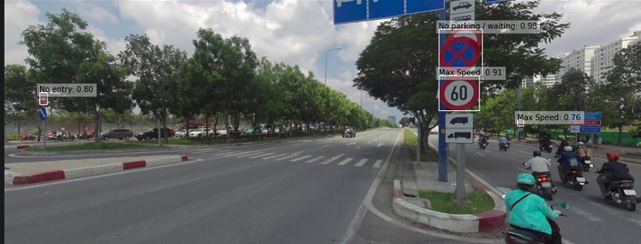
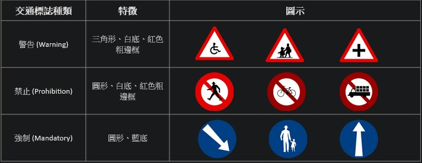
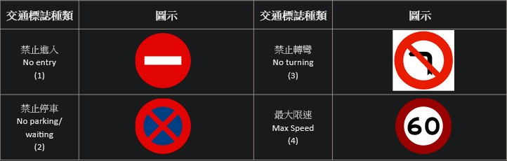
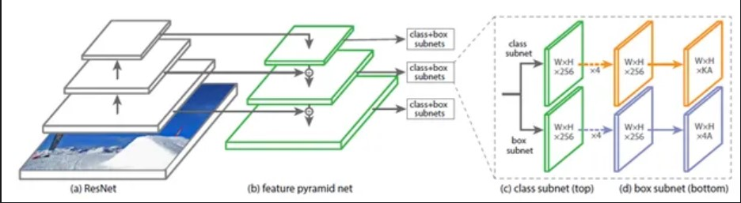
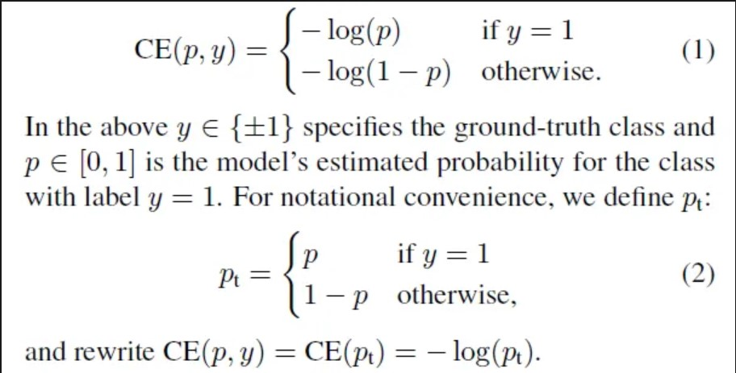
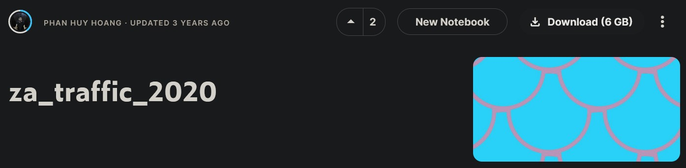
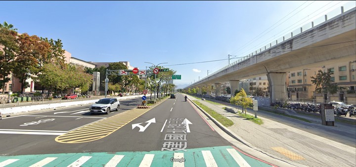
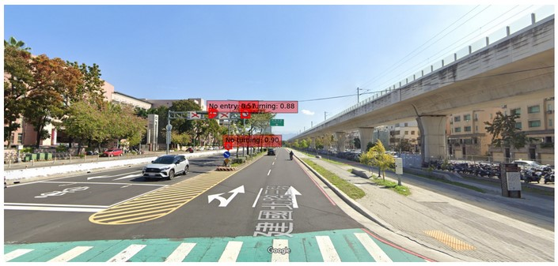

# <strong>
2023 Spring NCHU EE Introduction to Autotronics System Design Group 14

</strong>

## 
Traffic Sign Detection System 

# INDEX
1. [Introduction](#i-introduction)
2. [The Retina Net](#ii-retina-net)
3. [The Traffic Signs DataSets](#iii-za-traffic-2020)
4. [Results](#iv-results)
5. [References](#v-references)

# I. Introduction
## Goal

  

- Traffic sign detection is a crucial component of advanced driver assistance systems (ADAS) and autonomous vehicles, as it enables vehicles to interpret and respond to traffic regulations and conditions. One effective approach for traffic sign detection is utilizing deep learning algorithms, such as RetinaNet, which combines high accuracy and real-time performance.

- To train a traffic sign detection system using RetinaNet, a robust and diverse dataset is essential. Kaggle, a popular platform for data science competitions, offers numerous datasets that can be leveraged for this purpose. The Kaggle dataset for traffic sign detection typically contains a large collection of annotated images, where each image includes various traffic signs along with their corresponding class labels and bounding box coordinates.

## Sign Types

  

  

- We hope to spot and identify these 7 types of traffic signs presented within the photo.The traffic sign detection system aims to spot these specific signs within a given photo and accurately classify them into their respective categories. This capability enables the system to provide real-time information to drivers or autonomous vehicles, ensuring compliance with traffic regulations and enhancing overall road safety.

# II. [Retina Net](https://arxiv.org/abs/1708.02002)
## Structure of RetinaNet

  

- RetinaNet is a popular object detection model that combines a feature pyramid network (FPN) with a single-stage detection framework. It was introduced to address the challenges of accurately detecting objects at different scales and maintaining high detection quality.
## Focal Loss

  

- The key innovation of RetinaNet is the introduction of a novel loss function called the Focal Loss, which addresses the issue of class imbalance between background and foreground objects in the training data. The Focal Loss assigns higher weights to hard, misclassified examples and reduces the impact of well-classified examples, thereby focusing more on challenging object instances during training.

## Feature Pyramid Network FPN

  

- RetinaNet utilizes a feature pyramid network to generate a set of feature maps at multiple scales, enabling it to detect objects of different sizes.

- The RetinaNet model has gained popularity due to its effectiveness in achieving high accuracy and handling objects at various scales, making it suitable for a wide range of object detection tasks. Its architecture has been widely adopted and serves as a foundation for many state-of-the-art object detection models.

# III. [Traffic Sign Data Set](https://www.kaggle.com/datasets/phhasian0710/za-traffic-2020)

  

- The dataSet ZA Traffic 2020 we used is from kaggle, the training dataset and testing dataSet for our traffic sign detection system. The training dataset comprises a collection of images that are used to train the RetinaNet model. These images are typically captured from real-world scenarios and contain various traffic signs of interest. Each image in the training dataset is annotated with bounding box coordinates and class labels, indicating the location and type of each traffic sign present in the image.

# IV. Results

  

- Original photo taken for the testing of the system.By utilizing both the training and testing datasets from Kaggle, the traffic sign detection system can be trained to achieve high accuracy and robustness in identifying the seven types of traffic signs mentioned earlier. The training dataset provides the necessary information for the model to learn and generalize, while the testing dataset serves as a benchmark to evaluate the model's performance and determine its effectiveness in real-world scenarios.

  

- The result which successully detect and identify the traffic signs within the photo.Overall, the combination of the Kaggle dataset, along with the RetinaNet model, offers a comprehensive framework for developing a reliable and efficient traffic sign detection system capable of accurately spotting and identifying various types of traffic signs.

# V. References

[1] [Za_traffic_2020 dataset,Kaggle , Phan Huy Hoang , 2020](https://www.kaggle.com/datasets/phhasian0710/za-traffic-2020)

[2] [Focal Loss for Dense Object Detection,Tsung-Yi Lin, Priya Goyal, Ross Girshick, Kaiming He, Piotr Dollár, 2017, Arxiv](https://arxiv.org/abs/1708.02002)

[3] [RetinaNet 物件偵測 - RetinaNet 介紹, 22 12 , Medium, 2019](https://gino6178.medium.com/%E7%89%A9%E4%BB%B6%E5%81%B5%E6%B8%AC-retinanet-%E4%BB%8B%E7%B4%B9-dda4100673bb)
